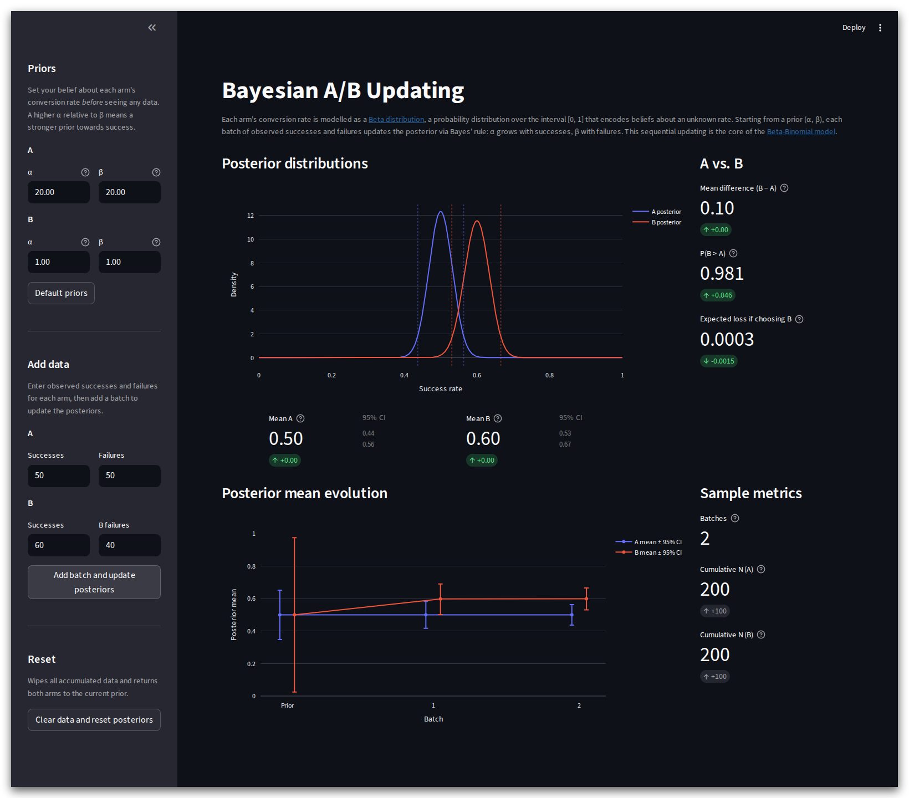

# Bayesian A/B Dashboard

An interactive tool for running sequential Bayesian A/B tests. Set your priors, feed in batches of observed data, and watch the posteriors update in real time.

[](https://bayesian-ab-dashboard.streamlit.app/)



## What it does

Each arm's conversion rate is modelled as a [Beta distribution](https://en.wikipedia.org/wiki/Beta_distribution). Starting from a prior (α, β), each batch of observed successes and failures updates the posterior via Bayes' rule: α grows with successes, β with failures. This is the [Beta-Binomial model](https://en.wikipedia.org/wiki/Beta-binomial_distribution).

### Posterior distributions

Shows the current posterior PDF for both arms, with 95% credible interval markers. Below the chart, the posterior mean and 95% CI are displayed for each arm, along with the change from the previous batch.

### A vs. B metrics

Three decision metrics computed via Monte Carlo sampling, each with an indicator showing the change from the last batch:

| Metric | What it means |
|---|---|
| **Mean difference (B − A)** | Current estimate of how much higher the success rate is in B over A |
| **P(B > A)** | Probability that B's true rate exceeds A's |
| **Expected loss if choosing B** | E\[max(A − B, 0)\] — average rate you'd forfeit by picking B if A were actually better |

### Posterior mean evolution

A timeline chart tracking how the posterior mean (± 95% CI) of each arm changes across batches. The CI error bars shrink as more data accumulates.

### Sample metrics

Batch count, cumulative N for each arm, and the last-batch increment.

## Usage

1. **Set priors** in the sidebar — adjust α and β for A and B independently. Higher α relative to β encodes a stronger prior belief in success. Moving a slider automatically resets all accumulated data.
2. **Enter observed data** — successes and failures for each arm in a batch.
3. **Add batch and update posteriors** — applies the update and adds a step to all charts.
4. **Clear data and reset posteriors** — wipes batches and returns to the current priors.
5. **Default priors** — resets sliders to A: α=20, β=20 and B: α=1, β=1.

## Running locally

```bash
uv sync
uv run streamlit run app.py
```

The app opens at `http://localhost:8501`.
